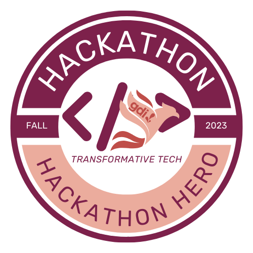

### Hello world!
#### I am looking to collaborate on open source projects with a political, social justice, or climate impact.
---

  </img>
 

I'm a full stack developer, currently working on a Python/Django/SQL stack. 
Likes: ☕ coffee, 🐦 bird-watching, science podcasts, and living in a humid but temperate zone. 💦 
Education: Self-taught hacker with degrees in Linguistics and Law. 
Favorite programming language: 🐍 python 
Currently learning: NodeJS 
Not confident about: 🚲 Riding a bicycle. 

Experienced in: 

Had a blast at the recently attended:
- [DemocracyLab Hackathon](https://www.democracylab.org/)
- [Seattle Gnu/Linux Conference](https://seagl.org/)
- [GDI Hackathon](https://girldevelopit.com/virtual-hackathon/)
- [Rails Hackathon](https://railshackathon.com/) See our project [here](https://github.com/LovlsGenesis/table_mapper)!
- [WomenWhoCode Hackathon for Good](https://hopin.com/events/wwcode-hackathon-for-social-good/registration) Our project was in the Top 10! Check it out [here](https://github.com/Idealyinfamous/super-brain-project)
- [GDI (Girl Develop It) Virtual Hackathon](https://girldevelopit.com/events/details/girl-develop-it-virtual-hackathon-presents-2023-virtual-hackathon/) as a mentor, received Hackathon Hero award :)

